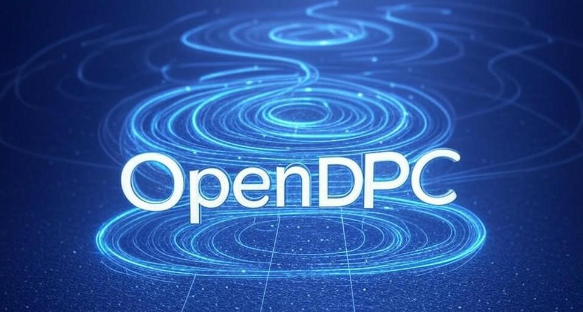

# OpenDPC

OpenDPC is an Open-Source platform for dynamic point clouds. We implement the first dynamic point cloud player, and a additional just noticeable distortion annotation module.

## Contact and References
Coordinator: Asst. Prof. Wei Gao (Shenzhen Graduate School, Peking University)
Should you have any suggestions for better constructing this open source library, please contact the coordinator via Email: gaowei262@pku.edu.cn. We welcome more participants to submit your codes to this collection, and you can send your OpenI ID to the above Email address to obtain the accessibility.

## List of Contributors
Contributors:
Asst. Prof. Wei Gao (Shenzhen Graduate School, Peking University)
Mr. Wenxu Gao (Shenzhen Graduate School, Peking University)
etc.

## Motivation

Dynamic point clouds, an innovative 3D data format, show great promise for applications such as virtual reality, self-driving vehicles, and more. However, the lack of effective playback tools has impeded their study and practical use. This paper presents OpenDPC, a pioneering open-source player for dynamic point clouds, built on Unity, to equip researchers and developers with a powerful solution for rendering dynamic point cloud sequences. OpenDPC supports sequence playback and provides versatile interaction capabilities to cater to various application demands. Additionally, it includes a just noticeable distortion (JND) annotation module that precisely detects the smallest perceivable distortions in multi-level distorted dynamic point clouds via comparative evaluation. Experimental outcomes highlight OpenDPC’s effectiveness in JND annotation, confirming its value as a dependable tool for dynamic point cloud research. By filling the essential gap in playback software, OpenDPC is set to propel advancements in related fields.

## Dynamic Point Cloud Processor
To enhance data rendering efficiency, we developed a dedicated processor for dynamic point clouds. The processing approach is outlined as follows: First, the raw dynamic point cloud data is repositioned to the origin of the coordinate system and normalized to fit within a unit sphere with a radius of 1, ensuring a suitable initial scale and centered visualization for convenient analysis. Subsequently, the R, G, B, and luminance values are compressed into a single 32-bit unsigned integer. Within this integer, bits 0–7 encode R, bits 8–15 encode G, bits 16–23 encode B, and bits 24–31 encode luminance, streamlining data transfer to GPU memory.

## Dynamic Point Cloud Player
To enable dynamic point cloud playback, the system first stores the preferences and inputs from the configuration interface. It then identifies all .ply files in the designated folder and transfers them to GPU memory. A blank model is positioned at the camera's center, and the point cloud models are displayed on this model at the chosen frame rate, ensuring smooth playback.

As a pioneering dynamic point cloud player, our tool offers an intuitive and streamlined interface. It supports real-time rendering and continuous looping of dynamic point cloud sequences. Users can pause or resume playback at their convenience. The player also features a frame counter and allows frame rate customization via the settings menu. During playback or when paused, the point cloud model can be freely rotated and scaled, enhancing user interaction.

## JND Subjective Platform

Beyond the player’s primary features, we carefully crafted a specialized sub-platform for conducting subjective experiments on just noticeable distortion (JND) in dynamic point clouds, with its configuration options. By default, each subjective comparison requires a minimum viewing time of 6 seconds (during which the judgment button is locked), and the observation frame rate is set to 15 fps. These settings can be modified by users to optimize their viewing experience. The model scaling factor is consistently set to 3.

In the JND evaluation process, each comparison entails assessing the original dynamic point cloud alongside its altered version to identify any noticeable differences. The visualization interface presents the original point cloud on the left and the distorted version on the right, with camera angles synchronized on both sides, enabling users to examine the dynamic point cloud models from any preferred perspective.

