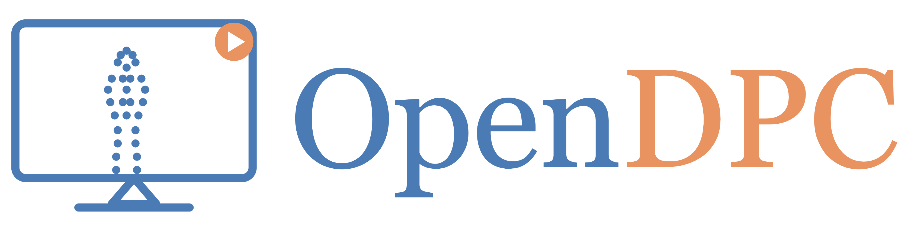
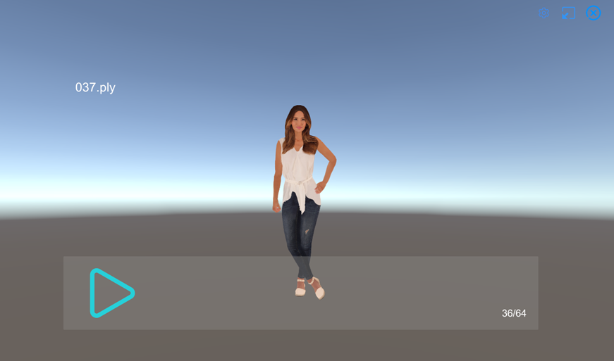
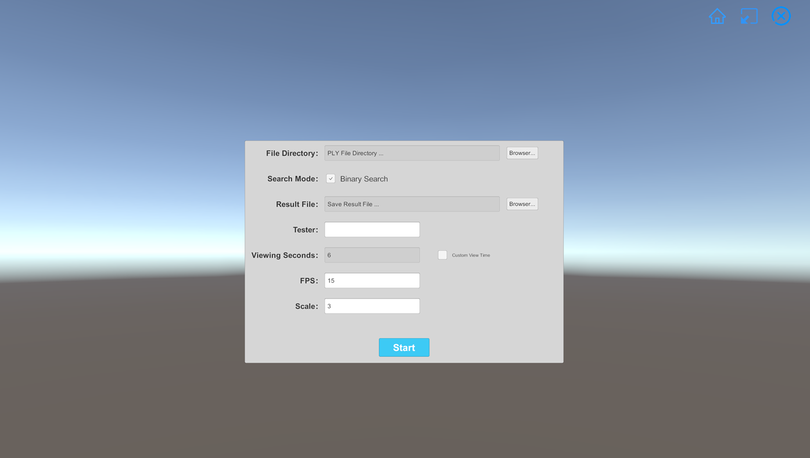
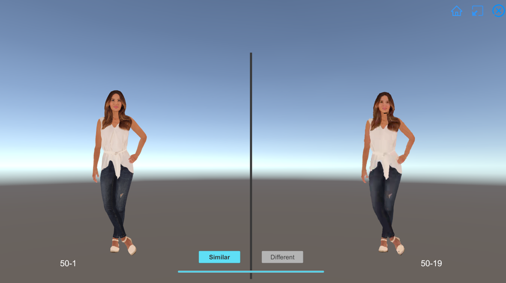
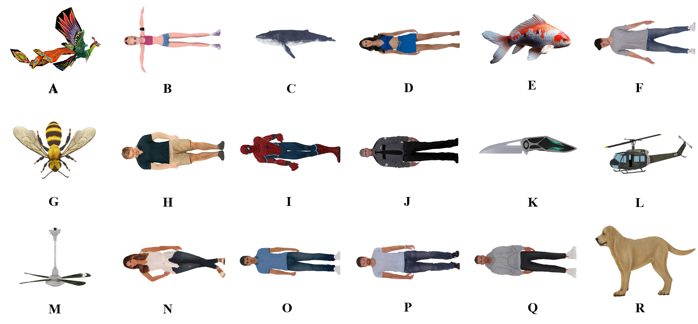

<div align="center">



**An open-source Unity-based dynamic point cloud player and paired-comparison platform for just-noticeable-distortion annotation**

[](#)
[](#)
[](#license)
[-orange)](#citation)
[](https://docs.google.com/presentation/d/1kI2ak1zXNcYN4-CCj-AFejLzboaM6lWH/edit?usp=sharing)

**🔗 GitHub:** <https://github.com/Terriao/OpenDPC>

</div>

> **Resources at a glance:**
> 📦 **Prebuilt software** → <https://github.com/Terriao/OpenDPC/blob/main/Software>
> 🎚 **V-PCC distortion ladder configs (20 rate points)** → <https://github.com/Terriao/OpenDPC/tree/main/ctc_configs>
> 🧪 **Test sequences** → <https://github.com/Terriao/OpenDPC/tree/main/test_data>

---

## Why this project exists

A dynamic point cloud is a *sequence* of point clouds — one per frame — and the format has matured into a serious 3D representation for VR, autonomous-driving telemetry, volumetric telepresence, and immersive cultural-heritage capture. The visualisation tooling around it has progressed in fragments: real-time pipelines for tele-presence and social VR (cwipc, VR2Gather), capture-to-display systems for studio environments (Hofer et al., 2018), and web-based viewers tuned for industrial inspection (Mei et al., 2023). What remains underserved is a tool that pairs **interactive offline playback** with a **reproducible subjective-evaluation harness** over a *published distortion ladder*, so that perceptual-quality results across labs become directly comparable.

OpenDPC targets exactly this gap. It is a Unity-based application that combines:

1. **A dynamic point cloud player** — frame-rate-correct, GPU-resident, interactive, looped, and built to handle full-length sequences without stuttering.
2. **An integrated JND annotation harness** — a paired-comparison interface for locating the lowest V-PCC rate point at which distortion crosses the perceptual threshold, on a per-sequence per-subject basis, over a published 20-point V-PCC ladder.
3. **A released subjective dataset** — 60 subjects × 18 sequences × 20 rate points, all collected with the harness above.

> *"Dynamic point clouds need playback infrastructure that is as boring and as reliable as a video player — and a perceptual-evaluation layer that does not get rebuilt every time a paper is written. OpenDPC tries to be both."*

---

## Position relative to prior work

Dynamic point cloud rendering itself has been addressed in several systems. Hofer et al. (IC3D 2018) built an end-to-end pipeline focused on capture-to-display latency for studio environments. Mei et al. (ICAICA 2023) released a web-based viewer optimised for industrial inspection of static and quasi-static parts. The open-source **cwipc** library (used by VR2Gather, ACM MM 2024) provides a comprehensive C++/Unity stack for capturing, compressing, transmitting, and rendering point clouds in social-VR tele-presence applications; cwipc's Unity package can also render pre-recorded `.ply` streams as a side-feature of its capture pipeline.

OpenDPC sits in a different design point. Rather than optimising for live capture-to-display latency or tele-presence orchestration, it targets the **offline, reproducible subjective-evaluation workflow**: a researcher loads a reference sequence and a fixed distortion ladder, runs a structured paired-comparison protocol, and exports a JND result that another lab can independently reproduce. The components OpenDPC contributes that the systems above do not bundle are: a paired-comparison JND harness with a ternary-refinement controller, an integrated published V-PCC distortion ladder, and the accompanying 60-subject subjective dataset.

| System | Primary purpose | Player | Built-in JND harness | Public distortion ladder | Released subjective data |
|---|---|:---:|:---:|:---:|:---:|
| **cwipc** / VR2Gather | Live capture / social VR | ✓ | — | — | — |
| **Hofer et al.** (IC3D 2018) | Capture-to-display pipeline | ✓ | — | — | — |
| **Mei et al.** (ICAICA 2023) | Web viewer for manufacturing | ✓ (static-friendly) | — | — | — |
| **OpenDPC** *(this work)* | Offline DPC playback + JND annotation | ✓ | ✓ | ✓ (20-rate V-PCC) | ✓ (60 subjects) |

The contribution we claim is the **integrated JND annotation workflow with the released ladder and dataset**, not a novel rendering algorithm.

### Relation to OpenVPC

OpenDPC and our concurrent **OpenVPC** project are sister codebases with distinct scope. OpenVPC is a broad collection of objective and subjective tools for **static** point clouds. OpenDPC is purpose-built for **dynamic sequences** and contributes three artefacts that OpenVPC does not: (i) a Unity real-time player for `.ply` sequences, (ii) a paired-comparison JND harness adapted to the *temporal* nature of dynamic content — with the dwell-time clock, camera-locked synchronisation, and frame-rate control that are meaningless for static models — and (iii) a published 60-subject JND dataset over the V-PCC 20-rate ladder for 18 dynamic sequences. The JND interface concept overlaps; the experimental protocol, the released dataset, and the player do not.

---

## Contents

1. [Overview](#overview)
2. [System architecture](#system-architecture)
3. [Repository layout](#repository-layout)
4. [Getting started](#getting-started)
5. [The player in detail](#the-player-in-detail)
6. [The JND sub-platform in detail](#the-jnd-sub-platform-in-detail)
7. [Test sequences and V-PCC quality tiers](#test-sequences-and-v-pcc-quality-tiers)
8. [Subjective experiment and results](#subjective-experiment-and-results)
9. [Use cases](#use-cases)
10. [Roadmap](#roadmap)
11. [FAQ](#faq)
12. [Citation](#citation)
13. [Community](#community)
14. [License](#license)
15. [Acknowledgements](#acknowledgements)
16. [Contributors and contact](#contributors-and-contact)

---

## Overview

| | Component | One-line description |
|---|---|---|
| 1 | **Dynamic point cloud processor** | A pre-rendering step that normalises geometry and bit-packs RGB-plus-luminance into a single 32-bit integer per point, ready for the GPU. |
| 2 | **Dynamic point cloud player** | Real-time looping playback of `.ply` sequences with pause / resume, frame counter, configurable FPS, free rotation, and free zoom. |
| 3 | **JND annotation sub-platform** | A side-by-side reference-versus-distorted viewer with synchronised camera and a Dichotomizing-or-Linear search controller that converges on the perceptual threshold across a 20-rate distortion ladder. |

All three components live inside a single Unity application; the user picks **Player Mode** or **JND Mode** from a Home Panel at launch, and the same preprocessing path serves both.

---

## System architecture

<div align="center">
<table><tr><td>
<pre>
┌──────────────────────────────────────────────────────────────────────┐
│                        Dynamic point cloud assets                    │
│            (per-frame .ply files; one folder per sequence)           │
└─────────────────────────────────┬────────────────────────────────────┘
                                  │
                  ┌───────────────▼───────────────┐
                  │   ❶ Dynamic point cloud       │
                  │      processor                │
                  │  · centring + unit-sphere     │
                  │    scaling                    │
                  │  · 32-bit RGB+luminance pack  │
                  └───────────────┬───────────────┘
                                  │  GPU buffers
                  ┌───────────────▼───────────────┐
                  │        Home Panel             │
                  │     (mode selection)          │
                  └───────────────┬───────────────┘
                                  │
              ┌───────────────────┴───────────────────┐
              │                                       │
   ┌──────────▼──────────┐               ┌────────────▼────────────┐
   │  ❷ Player           │               │  ❸ JND sub-platform     │
   │     Settings        │               │     Settings            │
   │       ↓             │               │       ↓                 │
   │     Playing         │               │     Playing             │
   │  · loop playback    │               │  · paired view          │
   │  · pause / resume   │               │  · synced camera        │
   │  · FPS control      │               │  · dichotomizing/linear │
   │  · rotate / zoom    │               │  · 6 s dwell timer      │
   └─────────────────────┘               └─────────────────────────┘
</pre>
</td></tr></table>
</div>

---

## Repository layout

```
OpenDPC/
├── Software/                # prebuilt Windows binary
│   └── software_v2.0.rar    # archive containing JNDModelStreamViewer.exe + Unity Data
├── ctc_configs/             # V-PCC rate-point configurations (the 20-point distortion ladder)
│   ├── ctc-r01.cfg          # rate point r1   (Lossless)
│   ├── ctc-r02.cfg          # rate point r2   (Near-lossless)
│   │   …
│   ├── ctc-r07.cfg          # rate point r7   (CTC R1)
│   ├── ctc-r10.cfg          # rate point r10  (CTC R2)
│   ├── ctc-r13.cfg          # rate point r13  (CTC R3)
│   ├── ctc-r16.cfg          # rate point r16  (CTC R4)
│   ├── ctc-r19.cfg          # rate point r19  (CTC R5)
│   │   …
│   └── ctc-r20.cfg          # rate point r20  (Very-low quality)
├── test_data/               # 18 test sequences in .ply form, ready for either Mode
├── logo.PNG                 # the project logo (used at the top of this README)
├── player.png               # player screenshot
├── jndviewer.png            # JND settings panel screenshot
├── jnd.png                  # paired-comparison view screenshot
├── samples.png              # 18-sequence thumbnail grid
└── README.md
```

- **Prebuilt software**: <https://github.com/Terriao/OpenDPC/tree/main/Software>
- **V-PCC distortion-ladder configs (20 rate points)**: <https://github.com/Terriao/OpenDPC/tree/main/ctc_configs>
- **Test sequences**: <https://github.com/Terriao/OpenDPC/tree/main/test_data>

---

## Getting started

### Prerequisites

A 64-bit **Windows** machine with a discrete GPU (≥ 4 GB VRAM recommended for sequences denser than 10⁶ points per frame). The current public release is Windows-only — macOS and Linux builds are on the [roadmap](#roadmap).

### Install and run

1. Download [`Software/software_v2.0.rar`](https://github.com/Terriao/OpenDPC/blob/main/Software/software_v2.0.rar) from the repository.
2. Extract the archive with WinRAR / 7-Zip to any local folder.
3. Double-click **`JNDModelStreamViewer.exe`** to launch.

### Try it on the bundled test data

The repository's [`test_data/`](https://github.com/Terriao/OpenDPC/tree/main/test_data) folder ships the 18 reference sequences used in our subjective experiments, and the 20-point V-PCC distortion ladder generated from them (see also [`ctc_configs/`](https://github.com/Terriao/OpenDPC/tree/main/ctc_configs) for the encoder configurations that produced the ladder). Point the application at `test_data/<sequence>/reference/` for Player Mode, or at `test_data/<sequence>/` (which contains both `reference/` and the per-rate-point subfolders) for JND Mode, and the harness will pick the structure up automatically.

### Prepare your own sequence

For a new sequence of your own:

1. Convert your dynamic 3D source to per-frame `.ply` files in a single folder, ordered lexicographically (`0001.ply`, `0002.ply`, …). Our `.glb → .obj → .ply` pipeline using **Blender** and **CloudCompare's Poisson-disk sampler** is described in [Asset preparation](#asset-preparation-pipeline) below.
2. To encode a V-PCC distortion ladder, drive the V-PCC reference encoder with the 20 configuration files in [`ctc_configs/`](https://github.com/Terriao/OpenDPC/tree/main/ctc_configs). The five CTC-aligned files (`ctc-r07.cfg`, `ctc-r10.cfg`, `ctc-r13.cfg`, `ctc-r16.cfg`, `ctc-r19.cfg`) correspond to CTC R1–R5; the remaining fifteen fill in intermediate quality levels for finer JND localisation.
3. Lay the encoded outputs out as one subfolder per rate point, each subfolder holding the same set of frame indices as the reference.

### Choose a mode

At launch the **Home Panel** presents two entry points:

- **Player Mode** → opens the playback **Settings Panel**, where you point at one sequence folder and adjust FPS / scale, then click *Start* to enter the **Playing Panel**.
- **JND Mode** → opens the annotation **Settings Panel**, where you supply the reference folder *and* the distortion-ladder folder, configure viewing seconds / FPS / scale / search mode, then click *Start* to enter the paired-comparison **Playing Panel**.

---

## The player in detail

<p align="center"></p>

The player is built around three design constraints we found missing in existing tools:

1. **Streaming-friendly memory.** Each `.ply` frame is pre-processed into a tightly-packed GPU buffer where the four-channel colour (R, G, B, luminance) is encoded as one 32-bit unsigned integer per point — bits 0–7 for R, 8–15 for G, 16–23 for B, 24–31 for luminance. The full sequence is uploaded to VRAM once and indexed per frame at playback time. The arithmetic is cheap; the memory bandwidth saved is real.

2. **Camera-anchored model.** Each frame is rendered onto a single empty model placed at the camera origin, which means rotation and zoom interact intuitively with the model rather than with the world. Pause does not freeze the camera — you can keep inspecting the geometry from any angle while a frame holds.

3. **Frame counter + adjustable FPS.** A persistent overlay shows the current frame index and the total length of the sequence. The settings panel lets you change the playback rate without restarting the viewer.

Interactive controls during playback:

<div align="center">
<table>
<tr><th>Action</th><th>Input</th></tr>
<tr><td>Pause / resume</td><td><code>Space</code> or the play/pause icon</td></tr>
<tr><td>Rotate model</td><td>Left-drag</td></tr>
<tr><td>Zoom</td><td>Scroll wheel</td></tr>
<tr><td>Change FPS</td><td>Settings panel (live)</td></tr>
</table>
</div>

> **Format support.** The current release accepts `.ply` only (the common output of V-PCC, G-PCC, and most acquisition pipelines). Importers for `.pcd`, `.las`, `.e57`, and on-the-fly `.obj → .ply` conversion are on the [roadmap](#roadmap); contributions welcome.

---

## The JND sub-platform in detail

<p align="center"></p>

### Configuration

The configuration screen exposes the parameters that previous JND-on-video studies have shown to dominate inter-subject variance:

| Parameter | Default | What it controls |
|---|---|---|
| **Viewing seconds** | 6 s | Minimum time the subject must observe each comparison before the verdict buttons unlock. Prevents reflex clicks and gives temporal masking time to settle. |
| **FPS** | 15 fps | Playback rate during evaluation. Lower than typical real-time playback to keep per-frame attention high. |
| **Model scale** | 3× | Apparent size of the model. Held constant so that retinal projection is comparable across subjects and sessions. |
| **Reference folder** | — | The pristine sequence. |
| **Distortion ladder folder** | — | A parent folder of subfolders, one per rate point, sorted by ascending distortion. |
| **Search Mode** | Dichotomizing | Selects the controller that walks the rate points (see [below](#search-mode)). |

### The viewer

<p align="center"></p>

The viewer shows the pristine sequence on the left and the candidate distorted sequence on the right. Crucially, **the two cameras are locked**: any rotation or zoom applied to one side is mirrored on the other, so the subject is never comparing apples and oranges at different angles. Two verdict buttons sit between the panels: `Similar` and `Different`.

### Search mode

The Settings Panel offers a **Search Mode** selector that determines how the harness walks the rate-point ladder:

- **Dichotomizing** *(default)* — the ternary-refinement controller described below. ~4–5 paired comparisons per sequence; the right choice for most subjective studies.
- **Linear** — exhaustively walks every rate point from r1 to r20 in order, one comparison each. ~20 comparisons per sequence; reserved for **ground-truth calibration**, for validating the Dichotomizing controller against a full-scan reference, or for studies where the full JND distribution (not just the threshold) is of interest.

### The ternary-search controller (Dichotomizing mode)

> **Terminology note.** The "interval" walked by the controller is a **rate-point interval** along the V-PCC distortion ladder — *not* a temporal interval within the sequence. Every comparison shows the **full sequence** from start to end; the controller only changes *which rate point* on the ladder gets paired against the reference.

Locating the JND boundary in a twenty-point distortion ladder by exhaustive comparison would need twenty trials per subject per sequence. We use a **ternary refinement** instead of a pure bisection, which is gentler on the noisy verdicts that subjective experiments inevitably produce:

```
Initial rate-point interval:  [r_lo, r_hi]  =  [r1, r20]
Loop until |r_hi - r_lo| ≤ 1:
    r_mid ← round( (r_lo + r_hi) / 2 )         the midpoint rate point on the ladder
    show paired comparison: reference  vs  candidate-at-r_mid (full sequence, both sides)
    wait for verdict (button unlocks after 6 s)
    if verdict = "Similar":      r_lo ← r_lo + ⌈(r_hi - r_lo) / 3⌉
                                 (drop the lower-rate, higher-quality third — still imperceptible there)
    if verdict = "Different":    r_hi ← r_hi - ⌈(r_hi - r_lo) / 3⌉
                                 (drop the higher-rate, lower-quality third — threshold lies below r_mid)
Output: r_lo of the final interval  =  this subject's JND rate point for this sequence
```

Trimming **a third** rather than a half at each step costs a small number of extra comparisons relative to plain bisection — but the surplus dampens the noise that comes from low-confidence verdicts near the threshold, and the rate point the controller settles on lands closer to the true JND across our subject pool. A more aggressive halving converges faster but is brittle when the subject is uncertain on the very comparison that drives the next decision.

Internally, the controller maintains a binary-tree representation of the visited rate-point intervals (`PointCloudBinaryTreeNodes`), so the full traversal of any session can be replayed post-hoc from the log file.

### Outputs

After a JND session finishes, the harness writes two artefacts:

- **Result file** — a per-subject record of the converged JND rate point for every sequence in the run, written through a native Windows save-file dialog (`ResultSaver`). The path and format are user-selectable.
- **Session log** — a rolling text log under `<install>/Logs/`, capped at the most recent N files (`FileLogger`). Useful for re-tracing a subject's verdict sequence or diagnosing UI / asset-loading issues after the fact.

---

## Test sequences and V-PCC quality tiers

The [`test_data/`](https://github.com/Terriao/OpenDPC/tree/main/test_data) folder contains eighteen dynamic models sourced from Sketchfab, covering objects, characters, and animals (see thumbnails below). For each model, the first 64 frames are encoded by **V-PCC** at the twenty rate points defined in [`ctc_configs/`](https://github.com/Terriao/OpenDPC/tree/main/ctc_configs), spanning nine quality tiers — from lossless down to very-low-quality. Five of the twenty rate points align with the **MPEG V-PCC Common Test Conditions** (CTC R1 through R5), so OpenDPC results are directly comparable to standardisation reports.

<p align="center"></p>

### V-PCC rate-point configuration

Each row of the table corresponds to one `.cfg` file in [`ctc_configs/`](https://github.com/Terriao/OpenDPC/tree/main/ctc_configs).

| Rate point | Config | occupancyPrecision † | Geometry QP | Attribute QP | Quality tier |
|:---:|:---|:---:|:---:|:---:|:---|
| r1  | [`ctc-r01.cfg`](https://github.com/Terriao/OpenDPC/blob/main/ctc_configs/ctc-r01.cfg) | 2 | −12 | 0  | Lossless |
| r2  | [`ctc-r02.cfg`](https://github.com/Terriao/OpenDPC/blob/main/ctc_configs/ctc-r02.cfg) | 2 | −6  | 6  | Near-lossless |
| r3  | [`ctc-r03.cfg`](https://github.com/Terriao/OpenDPC/blob/main/ctc_configs/ctc-r03.cfg) | 2 | 0   | 9  | Near-lossless |
| r4  | [`ctc-r04.cfg`](https://github.com/Terriao/OpenDPC/blob/main/ctc_configs/ctc-r04.cfg) | 2 | 4   | 12 | High fidelity |
| r5  | [`ctc-r05.cfg`](https://github.com/Terriao/OpenDPC/blob/main/ctc_configs/ctc-r05.cfg) | 2 | 8   | 16 | High fidelity |
| r6  | [`ctc-r06.cfg`](https://github.com/Terriao/OpenDPC/blob/main/ctc_configs/ctc-r06.cfg) | 2 | 12  | 20 | High fidelity |
| r7  | [`ctc-r07.cfg`](https://github.com/Terriao/OpenDPC/blob/main/ctc_configs/ctc-r07.cfg) | 4 | 16  | 22 | High quality · **CTC R1** |
| r8  | [`ctc-r08.cfg`](https://github.com/Terriao/OpenDPC/blob/main/ctc_configs/ctc-r08.cfg) | 4 | 17  | 23 | High quality |
| r9  | [`ctc-r09.cfg`](https://github.com/Terriao/OpenDPC/blob/main/ctc_configs/ctc-r09.cfg) | 4 | 18  | 24 | High quality |
| r10 | [`ctc-r10.cfg`](https://github.com/Terriao/OpenDPC/blob/main/ctc_configs/ctc-r10.cfg) | 4 | 20  | 27 | Medium-high quality · **CTC R2** |
| r11 | [`ctc-r11.cfg`](https://github.com/Terriao/OpenDPC/blob/main/ctc_configs/ctc-r11.cfg) | 4 | 21  | 29 | Medium-high quality |
| r12 | [`ctc-r12.cfg`](https://github.com/Terriao/OpenDPC/blob/main/ctc_configs/ctc-r12.cfg) | 4 | 22  | 30 | Medium-high quality |
| r13 | [`ctc-r13.cfg`](https://github.com/Terriao/OpenDPC/blob/main/ctc_configs/ctc-r13.cfg) | 4 | 24  | 32 | Medium quality · **CTC R3** |
| r14 | [`ctc-r14.cfg`](https://github.com/Terriao/OpenDPC/blob/main/ctc_configs/ctc-r14.cfg) | 4 | 25  | 33 | Medium quality |
| r15 | [`ctc-r15.cfg`](https://github.com/Terriao/OpenDPC/blob/main/ctc_configs/ctc-r15.cfg) | 4 | 26  | 34 | Medium quality |
| r16 | [`ctc-r16.cfg`](https://github.com/Terriao/OpenDPC/blob/main/ctc_configs/ctc-r16.cfg) | 4 | 28  | 37 | Medium-low quality · **CTC R4** |
| r17 | [`ctc-r17.cfg`](https://github.com/Terriao/OpenDPC/blob/main/ctc_configs/ctc-r17.cfg) | 4 | 29  | 38 | Medium-low quality |
| r18 | [`ctc-r18.cfg`](https://github.com/Terriao/OpenDPC/blob/main/ctc_configs/ctc-r18.cfg) | 4 | 30  | 39 | Medium-low quality |
| r19 | [`ctc-r19.cfg`](https://github.com/Terriao/OpenDPC/blob/main/ctc_configs/ctc-r19.cfg) | 4 | 32  | 42 | Low quality · **CTC R5** |
| r20 | [`ctc-r20.cfg`](https://github.com/Terriao/OpenDPC/blob/main/ctc_configs/ctc-r20.cfg) | 4 | 36  | 48 | Very-low quality |

> † `occupancyPrecision` is the V-PCC reference-encoder *occupancy-map precision parameter* — a **dimensionless block-size index** (geometry block precision in voxel units of the underlying grid), not a physical distance in mm or cm. The Geometry-QP and Attribute-QP columns are standard V-PCC quantisation parameters.

Total compressed asset size: 18 sequences × 20 rate points × 64 frames = **23,040 distorted frames** ready for evaluation.

### Asset preparation pipeline

Source `.glb` models from Sketchfab were converted to colour-bearing `.ply` sequences in two stages:

```
.glb (Sketchfab)  ──Blender──►  .obj + textures  ──CloudCompare batch──►  .ply sequence
```

**Sampling method.** The `.obj → .ply` conversion uses **CloudCompare's Poisson-disk sampling** to produce a roughly uniform point density across the surface (cf. uniform random sampling, which under-samples low-curvature regions). For very fine geometry (sequences F, M) we additionally cap the per-frame point count at 100 K to keep playback responsive on mid-range GPUs. The choice of sampler does affect downstream JND thresholds — uniform random sampling typically yields a noisier surface and slightly lower (more sensitive) JND values; Poisson-disk gives the most stable thresholds in our pilot study, which is why we adopted it. The script is parameterised, so switching sampler is a one-flag change.

The whole pipeline is batch-scriptable rather than interactive, so adding new sequences to the test library is a single command.

---

## Subjective experiment and results

### Protocol

We split the 18 sequences into two non-overlapping groups (A–I and J–R) and recruited **sixty volunteers**, thirty per group. The pool mixed multimedia-research-trained subjects with naive participants to keep generalisation honest. Before any data was collected, every subject went through a calibration session covering the protocol, the interface, and the verdict semantics; subjects could request a break at any point during the actual experiment to reduce visual fatigue.

Outlier verdicts were trimmed under the **ITU-R BT.500-13** screening rule before averaging.

### Per-subject JND results, group 1 (sequences A–I, subjects 1–30)

> **Read this table as:** "For sequence A, subject 1 found the distortion first noticeable at rate point r20; subject 2 at r16; …". Lower numbers mean tighter perceptual thresholds.

| Seq | s1 | s2 | s3 | s4 | s5 | s6 | s7 | s8 | s9 | s10 | s11 | s12 | s13 | s14 | s15 | s16 | s17 | s18 | s19 | s20 | s21 | s22 | s23 | s24 | s25 | s26 | s27 | s28 | s29 | s30 | **Mean** | **Std** |
|:---:|:--:|:--:|:--:|:--:|:--:|:--:|:--:|:--:|:--:|:---:|:---:|:---:|:---:|:---:|:---:|:---:|:---:|:---:|:---:|:---:|:---:|:---:|:---:|:---:|:---:|:---:|:---:|:---:|:---:|:---:|:---:|:---:|
| A | 20 | 16 | 16 | 9  | 12 | 19 | 19 | 14 | 18 | 19 | 5  | 13 | 8  | 20 | 8  | 12 | 12 | 16 | 7  | 13 | 15 | 16 | 18 | 20 | 9  | 18 | 10 | 12 | 7  | 8  | **13.63** | 4.60 |
| B | 16 | 13 | 13 | 15 | 9  | 7  | 16 | 13 | 13 | 14 | 7  | 11 | 12 | 10 | 12 | 7  | 9  | 12 | 9  | 9  | 9  | 9  | 9  | 16 | 7  | 7  | 5  | 9  | 5  | 9  | **10.40** | 3.20 |
| C | 13 | 12 | 16 | 16 | 6  | 14 | 19 | 7  | 9  | 14 | 10 | 14 | 14 | 20 | 16 | 7  | 7  | 14 | 20 | 9  | 14 | 7  | 7  | 19 | 9  | 13 | 12 | 12 | 7  | 12 | **12.30** | 4.21 |
| D | 16 | 11 | 15 | 13 | 14 | 13 | 16 | 12 | 7  | 13 | 9  | 15 | 7  | 9  | 15 | 7  | 9  | 16 | 11 | 13 | 13 | 7  | 7  | 13 | 14 | 12 | 12 | 12 | 12 | 8  | **11.70** | 2.97 |
| E | 13 | 5  | 9  | 14 | 7  | 14 | 18 | 16 | 7  | 14 | 7  | 14 | 14 | 14 | 16 | 7  | 7  | 16 | 9  | 9  | 9  | 7  | 7  | 13 | 11 | 9  | 7  | 7  | 5  | 7  | **10.40** | 3.84 |
| F | 16 | 5  | 7  | 14 | 12 | 16 | 16 | 14 | 10 | 16 | 9  | 13 | 11 | 15 | 9  | 10 | 9  | 14 | 7  | 9  | 14 | 7  | 9  | 13 | 12 | 16 | 9  | 12 | 7  | 7  | **11.27** | 3.36 |
| G | 19 | 9  | 14 | 16 | 20 | 18 | 20 | 16 | 15 | 20 | 7  | 16 | 20 | 20 | 18 | 13 | 9  | 19 | 18 | 19 | 14 | 5  | 7  | 16 | 11 | 19 | 9  | 18 | 12 | 12 | **14.97** | 4.57 |
| H | 13 | 6  | 12 | 14 | 16 | 14 | 16 | 16 | 13 | 16 | 5  | 12 | 12 | 20 | 12 | 9  | 12 | 12 | 14 | 9  | 15 | 9  | 7  | 19 | 9  | 14 | 10 | 13 | 9  | 9  | **12.23** | 3.58 |
| I | 13 | 9  | 18 | 16 | 14 | 16 | 18 | 19 | 14 | 19 | 14 | 16 | 16 | 19 | 14 | 14 | 8  | 15 | 10 | 13 | 16 | 7  | 16 | 18 | 16 | 14 | 12 | 16 | 9  | 9  | **14.27** | 3.40 |

### Per-subject JND results, group 2 (sequences J–R, subjects 31–60)

| Seq | s31 | s32 | s33 | s34 | s35 | s36 | s37 | s38 | s39 | s40 | s41 | s42 | s43 | s44 | s45 | s46 | s47 | s48 | s49 | s50 | s51 | s52 | s53 | s54 | s55 | s56 | s57 | s58 | s59 | s60 | **Mean** | **Std** |
|:---:|:---:|:---:|:---:|:---:|:---:|:---:|:---:|:---:|:---:|:---:|:---:|:---:|:---:|:---:|:---:|:---:|:---:|:---:|:---:|:---:|:---:|:---:|:---:|:---:|:---:|:---:|:---:|:---:|:---:|:---:|:---:|:---:|
| J | 16 | 13 | 15 | 16 | 15 | 16 | 16 | 13 | 11 | 18 | 13 | 14 | 16 | 18 | 16 | 18 | 7  | 18 | 15 | 13 | 16 | 12 | 12 | 18 | 15 | 18 | 16 | 16 | 12 | 16 | **14.93** | 2.55 |
| K | 20 | 7  | 8  | 16 | 11 | 15 | 18 | 13 | 11 | 15 | 13 | 6  | 17 | 10 | 16 | 16 | 14 | 10 | 15 | 16 | 13 | 20 | 6  | 7  | 5  | 18 | 18 | 19 | 6  | 14 | **13.10** | 4.58 |
| L | 20 | 10 | 16 | 17 | 14 | 14 | 16 | 16 | 9  | 19 | 13 | 7  | 9  | 10 | 18 | 14 | 13 | 7  | 9  | 9  | 12 | 20 | 7  | 7  | 7  | 19 | 16 | 12 | 9  | 13 | **12.73** | 4.27 |
| M | 20 | 9  | 13 | 18 | 8  | 14 | 16 | 13 | 13 | 9  | 9  | 7  | 17 | 7  | 19 | 16 | 9  | 5  | 7  | 16 | 15 | 12 | 7  | 9  | 5  | 19 | 18 | 16 | 15 | 16 | **12.57** | 4.60 |
| N | 18 | 10 | 16 | 16 | 15 | 17 | 16 | 13 | 18 | 18 | 9  | 13 | 14 | 13 | 18 | 15 | 12 | 14 | 16 | 13 | 13 | 12 | 9  | 9  | 12 | 18 | 16 | 16 | 9  | 12 | **14.00** | 2.95 |
| O | 16 | 9  | 2  | 17 | 14 | 18 | 16 | 16 | 16 | 18 | 13 | 12 | 5  | 12 | 16 | 15 | 13 | 14 | 16 | 13 | 11 | 12 | 7  | 13 | 7  | 19 | 15 | 16 | 9  | 16 | **13.20** | 4.06 |
| P | 13 | 14 | 10 | 16 | 14 | 16 | 18 | 18 | 14 | 19 | 13 | 13 | 16 | 9  | 16 | 16 | 12 | 18 | 13 | 14 | 12 | 12 | 14 | 14 | 16 | 18 | 16 | 18 | 13 | 14 | **14.63** | 2.48 |
| Q | 16 | 8  | 2  | 17 | 16 | 13 | 16 | 18 | 17 | 15 | 13 | 9  | 15 | 9  | 18 | 16 | 13 | 17 | 18 | 12 | 15 | 16 | 7  | 16 | 5  | 16 | 15 | 16 | 10 | 16 | **13.67** | 4.13 |
| R | 13 | 5  | 15 | 16 | 16 | 17 | 18 | 13 | 18 | 19 | 13 | 14 | 15 | 9  | 18 | 16 | 10 | 18 | 16 | 14 | 16 | 16 | 7  | 12 | 7  | 16 | 16 | 16 | 7  | 15 | **14.03** | 3.77 |

### What the data tells us

**The JND clusters in the middle of the ladder.** Across every one of the 18 sequences the mean JND falls inside the **r10–r15 band** — the transition from *medium-high* to *medium* quality. Below r10 the eye is forgiving; above r15 it is unforgiving; right in between is where the threshold lives.

This has a direct codec-side implication. If a V-PCC encoder picks any rate point above r15 for a perceptually-lossless target, it is leaving bandwidth on the floor — distortion at r15 is already invisible to most observers. If it picks anything below r10, it is buying marginal bitrate savings against visible quality loss. The r10–r15 band is the sweet spot for **maximally aggressive yet perceptually-safe** V-PCC compression.

**Low-motion sequences yield tighter agreement.** Sequences **D, J, P, and N** show the smallest inter-subject standard deviation — they also happen to be the four sequences with the smallest frame-to-frame motion. With less motion, temporal masking weakens, the JND threshold depends less on each viewer's tracking strategy, and verdicts converge. A practical consequence: high-motion content needs more subjects per study to reach the same confidence as low-motion content, and any future JND model for dynamic point clouds should be evaluated *separately* on high- and low-motion subsets.

> **On choice of perceptual signal.** Our current evaluation uses overall V-PCC distortion as the visibility variable, not a temporal-artifact-specific signal (e.g., flicker, surface popping, or seam discontinuities under V-PCC patch updates). This is a deliberate scoping choice: V-PCC distortion is the signal that codec implementers actually tune, so the published JND thresholds are immediately actionable for rate-control work. Adding a dedicated **temporal-artefact JND track** (variant comparisons that hold spatial quality fixed and vary temporal artefact severity) is one of the main items on the [roadmap](#roadmap).

---

## Use cases

OpenDPC has been built with three downstream applications in mind:

1. **Rate-distortion calibration for dynamic point cloud codecs.** Use the JND results to set perceptually-meaningful target bitrates instead of arbitrary PSNR points.
2. **Subjective ground truth for point cloud quality assessment.** Pair the JND ladder with objective quality scores to train and validate PCQA models.
3. **Demos and pedagogy.** The player on its own is a clean demo platform for showcasing dynamic point cloud capture, compression, or rendering algorithms.

The repository is permissively licensed for both research and commercial extension.

---

## Roadmap

- **Cross-platform builds** — the current public release is Windows-only (uses native Win32 file dialogs and folder pickers via `Win32API`/`VistaFileDialog`). The Unity codebase is portable; macOS and Linux build profiles are on the immediate roadmap, blocked only on substituting `Standalone File Browser` for the native Windows shell calls.
- **Broader format support** — importers for `.pcd`, `.las`, `.e57`, and on-the-fly `.obj → .ply` conversion, removing the current `.ply`-only restriction.
- **Temporal-artefact JND track** — paired-comparison variants that hold spatial quality constant and vary *temporal* distortions (flicker, V-PCC patch popping, seam discontinuities), so that motion-specific perceptual thresholds can be measured alongside the spatial-distortion thresholds reported here.
- **GPU-streamed long sequences** — current VRAM-resident pipeline caps sequences at the GPU's free memory; a sliding-window streamer is in development.
- **Automated JND batch mode** — head-mounted display integration and automated session orchestration to scale subjective studies.
- **Beyond V-PCC** — distortion ladders generated by G-PCC and by emerging learned codecs.
- **Public mirror on OpenI** — synchronised mirror at Peng Cheng Laboratory's OpenI platform for users behind GitHub-restricted networks.

---

## FAQ

**How does OpenDPC differ from cwipc / VR2Gather, Hofer 2018, or web-based viewers?**
Those systems are optimised for *live capture-to-display* (Hofer 2018), *social-VR tele-presence* (cwipc / VR2Gather), or *web-based viewing* of mostly static or quasi-static parts (Mei 2023). OpenDPC is optimised for the **offline, reproducible subjective-evaluation workflow** — loading a reference and a fixed distortion ladder, running a structured paired-comparison protocol, and exporting JND results that another lab can independently reproduce. The unique pieces are the integrated JND harness, the released V-PCC distortion ladder, and the 60-subject dataset.

**Why Unity and not a custom OpenGL renderer?**
Unity gave us a working cross-platform shader pipeline on day one, an interaction layer (drag, zoom, UI panels) that did not need to be hand-rolled, and a build system that targets Windows, macOS, and Linux from the same source tree. The cost is a heavier runtime; the saving is months of engineering. For a research-grade tool, the trade lands in Unity's favour.

**How long does one JND annotation session take per subject?**
About 12–15 minutes for the nine sequences in one group, under the default Dichotomizing search mode. Each sequence converges in 4–5 paired comparisons, plus the mandatory 6 s dwell time per comparison. Linear mode roughly quadruples the duration.

**Can I plug in my own distortion ladder?**
Yes. The JND harness only needs an ordered set of subfolders, one per rate point, with the same frame count and indexing as the reference. Whether the distortions come from V-PCC, G-PCC, a learned codec, or hand-injected noise is opaque to the harness.

**What sampling method was used to make the `.ply` sequences in `test_data/`?**
Poisson-disk sampling via CloudCompare, with a 100 K-point cap on the densest sequences (F, M). Uniform random sampling produces a noisier surface and slightly destabilises the JND threshold; Poisson-disk gave the tightest pilot-study results.

**What does `occupancyPrecision` in the rate-point table actually mean?**
It is the V-PCC reference encoder's occupancy-map precision parameter — a *dimensionless block-size index* over the geometry voxel grid. It does **not** carry a metric unit (mm/cm).

**What's the data licence on the 18 sequences in `test_data/`?**
The source `.glb` models are individually licensed via Sketchfab and are not redistributed in this repo. The conversion scripts and the encoded V-PCC ladders are released under the same MIT licence as the codebase; consult the individual model licences before redistributing the raw asset.

**Where are the session logs written?**
Under `<install>/Logs/`, one file per session, rolled at a fixed file-count cap. The log records the full ternary-search path (or the linear-scan path) and any UI / asset-loading exceptions raised during the session.

---

## Citation

If OpenDPC supports your research, please cite the companion paper:

```bibtex
@inproceedings{gao2026opendpc,
  title     = {OpenDPC: An Open Source Dynamic Point Cloud Player and Platform
               for Just Noticeable Distortion},
  author    = {Gao, Wenxu and Fan, Songlin and Gao, Wei},
  booktitle = {Proceedings of the 34th ACM International Conference on Multimedia},
  year      = {2026},
  note      = {Under review}
}
```

When you build on V-PCC results, please also cite the MPEG V-PCC standard (Graziosi et al. 2020) and the BT.500-13 protocol (ITU-R 2012).

---

## Community

OpenDPC is released under the **MIT License** and hosted on [GitHub](https://github.com/Terriao/OpenDPC).

We welcome:

- New test sequences (please bring their Sketchfab / source licence)
- Distortion-ladder generators for codecs other than V-PCC
- Cross-platform builds (macOS, Linux) and the file-dialog refactor that unblocks them
- Importers for additional point cloud formats (`.pcd`, `.las`, `.e57`)
- Temporal-artefact JND protocols
- Translations of the in-app strings (currently English-only)
- Bug reports, especially around long sequences, large attributes, and edge cases in the Dichotomizing controller

Open an issue first for non-trivial contributions so we can align on interfaces. Pull requests are merged after review.

---

## License

Source code is released under the **MIT License**. Encoded V-PCC distortion ladders are released under the same license, subject to the individual Sketchfab licences of the underlying 3D models. The Unity engine itself is governed by Unity's standard licensing terms — please consult Unity Technologies for redistribution constraints on engine binaries.

---

## Acknowledgements

OpenDPC builds on the work of the **MPEG V-PCC** standardisation activity, the **ITU-R BT.500-13** subjective-evaluation methodology, the **Unity** engine, and the dynamic 3D modelling community that contributes content to **Sketchfab**. We acknowledge prior open and academic work on dynamic point cloud visualisation, including the **cwipc** library and its social-VR application **VR2Gather** (Jansen et al., ACM MM 2024), **Hofer et al.** (IC3D 2018), and **Mei et al.** (ICAICA 2023) — OpenDPC complements these systems by occupying a different design point (offline reproducible JND evaluation), not by competing with them on live capture or rendering.

We thank the sixty subjects who participated in the JND study, and **Peng Cheng Laboratory** together with the **OpenI** platform for compute resources and the planned public mirror of the repository.

---

## Contributors and contact

| Role | Name | Affiliation |
|------|------|-------------|
| Coordinator | Asso. Prof. Wei Gao | School of Electronic and Computer Engineering, Peking University · Peng Cheng Laboratory |
| Lead developer | Wenxu Gao | School of Electronic and Computer Engineering, Peking University · Peng Cheng Laboratory |
| Contributor | Songlin Fan | Institute of Trustworthy Embodied AI, Fudan University · China Mobile Shanghai ICT Co., Ltd. |

For questions, collaboration, OpenI mirror access, or push privileges, please contact:

**Asso. Prof. Wei Gao** — `gaowei262@pku.edu.cn`

Bug reports and feature requests are tracked via [GitHub Issues](https://github.com/Terriao/OpenDPC/issues).

---

<div align="center">
<sub>OpenDPC · Built at the Wei Gao group, Peking University and Peng Cheng Laboratory.</sub>
</div>
